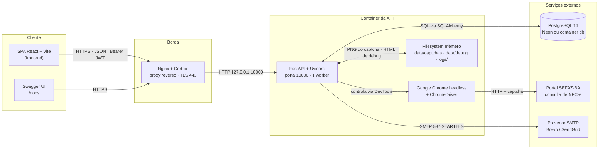
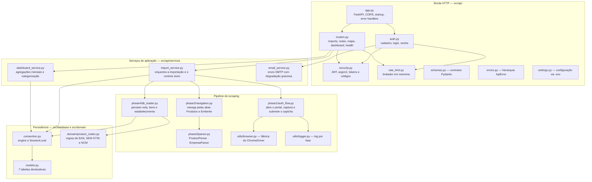
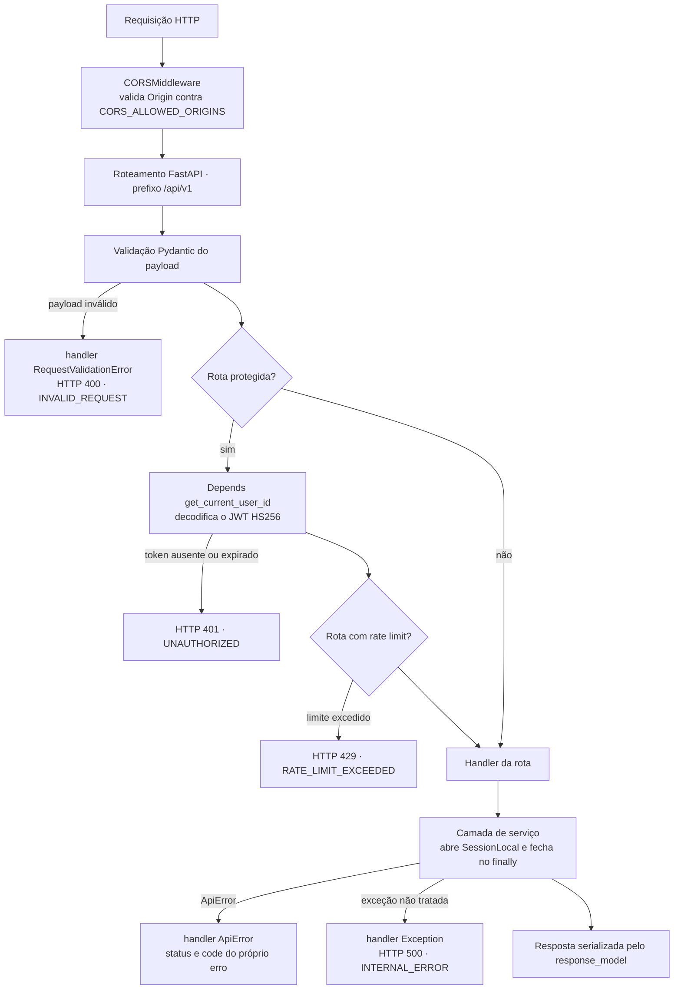
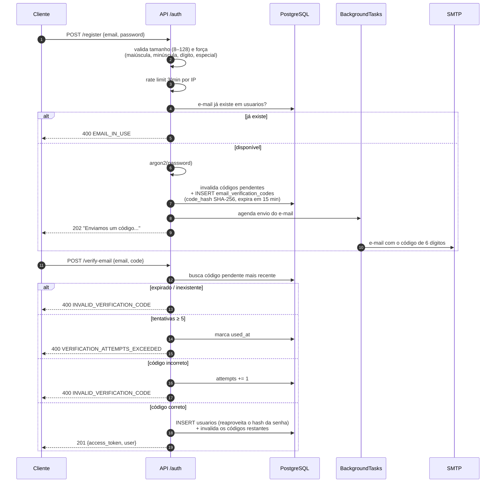
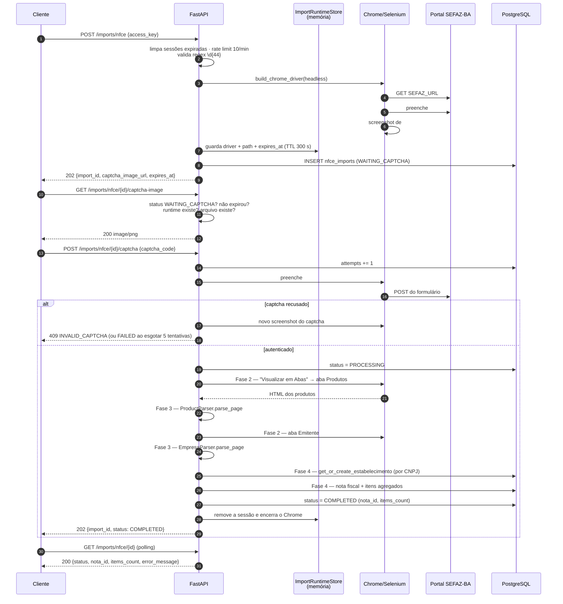
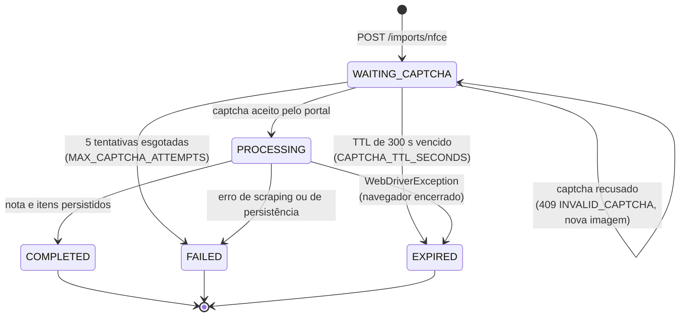
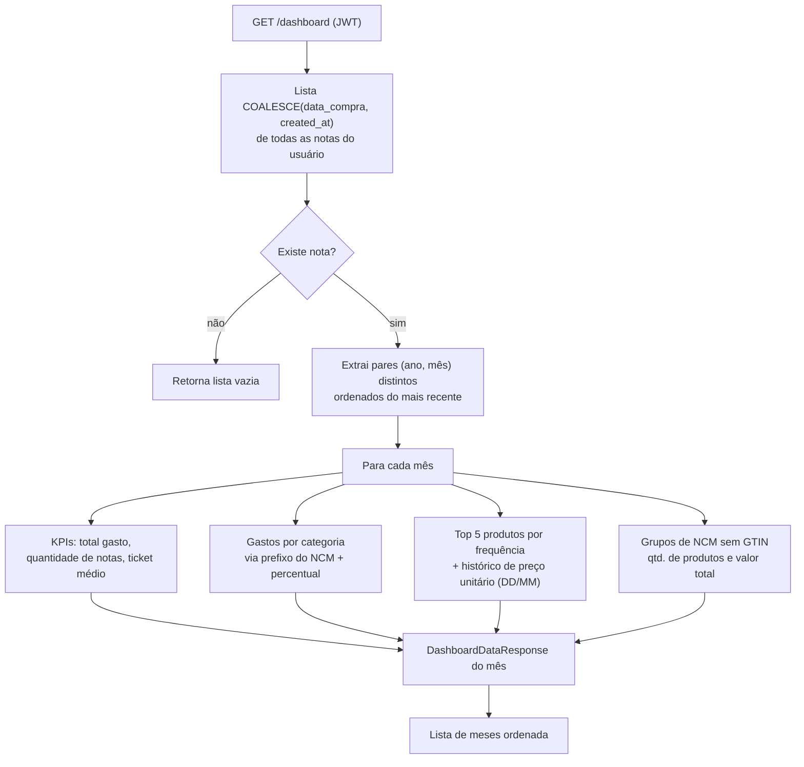
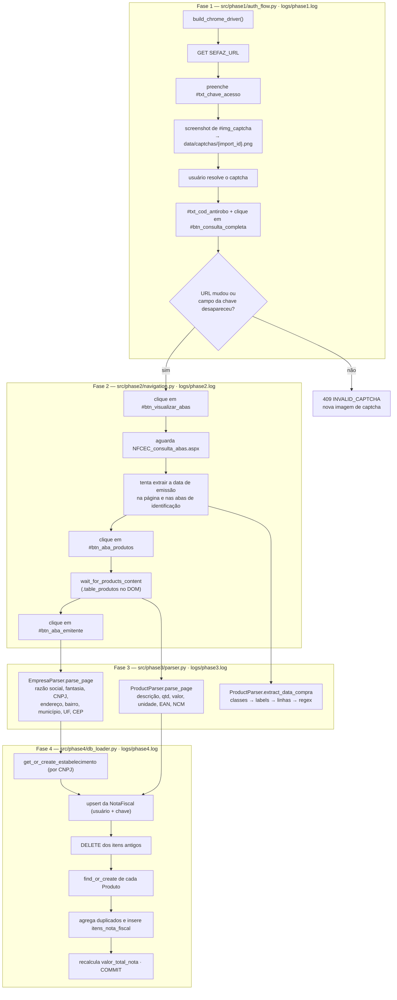
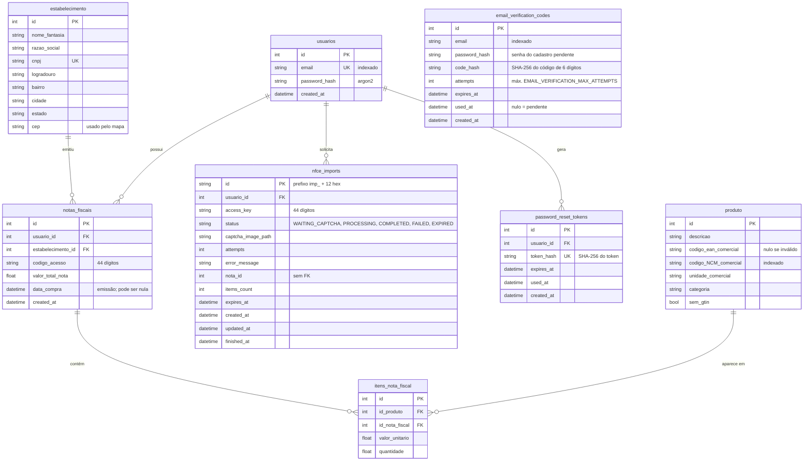
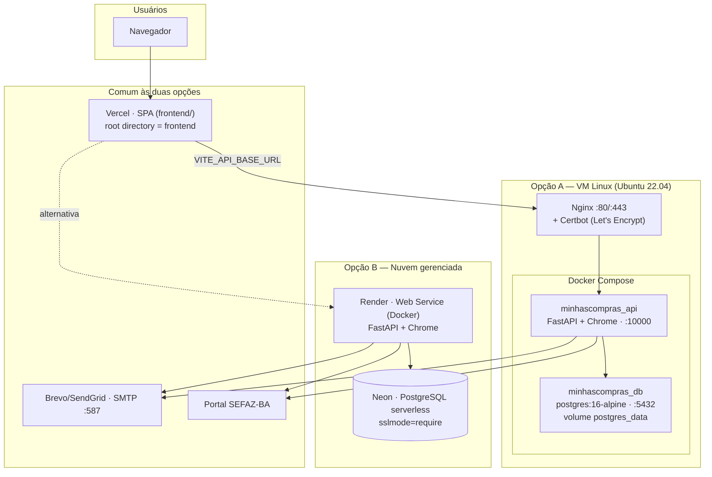

# Minhas Compras BA — API (Backend)

API REST que importa **NFC-e (Nota Fiscal de Consumidor Eletrônica)** do portal da
SEFAZ-BA a partir da chave de acesso de 44 dígitos, normaliza os dados de notas,
produtos e estabelecimentos em um banco relacional e expõe indicadores de consumo
para o usuário final.

O portal da SEFAZ-BA não oferece API pública para consulta de NFC-e e protege as
consultas com captcha. Por isso o backend embarca um **robô de navegador
(Selenium + Google Chrome)**: ele abre o portal, preenche a chave de acesso, devolve
a imagem do captcha para o usuário resolver e, com a sessão autenticada, raspa o
HTML da nota.

---

## Sumário

1. [Stack tecnológica](#1-stack-tecnológica)
2. [Arquitetura](#2-arquitetura)
3. [Serviços da aplicação](#3-serviços-da-aplicação)
4. [Pipeline de scraping (Fases 1 a 4)](#4-pipeline-de-scraping-fases-1-a-4)
5. [Banco de dados](#5-banco-de-dados)
6. [Documentação da API (Swagger / OpenAPI)](#6-documentação-da-api-swagger--openapi)
7. [Infraestrutura e cloud](#7-infraestrutura-e-cloud)
8. [Variáveis de ambiente](#8-variáveis-de-ambiente)
9. [Execução local](#9-execução-local)
10. [Deploy](#10-deploy)
11. [Operação e manutenção](#11-operação-e-manutenção)
12. [Segurança](#12-segurança)
13. [Limitações conhecidas e próximos passos](#13-limitações-conhecidas-e-próximos-passos)

---

## 1. Stack tecnológica

| Camada                 | Tecnologia                                                    | Papel no sistema                                       |
| :--------------------- | :------------------------------------------------------------ | :----------------------------------------------------- |
| Runtime                | **Python 3.12**                                               | Linguagem e imagem base (`python:3.12-slim`)           |
| Web framework          | **FastAPI** ≥ 0.111                                           | Roteamento, validação e geração do OpenAPI/Swagger     |
| ORM                    | **SQLAlchemy 2.0** (declarativo tipado)                       | Modelos, queries e transações                          |
| Banco de dados         | **PostgreSQL 16** (produção) · **SQLite** (fallback local)    | Persistência relacional                                |
| Automação de navegador | **Selenium** ≥ 4.21 + **Google Chrome** + `webdriver-manager` | Autenticação no portal SEFAZ e captura do captcha      |
| Parsing HTML           | **BeautifulSoup 4** + **lxml**                                | Extração de produtos, emitente e data de emissão       |
| E-mail                 | **smtplib** (stdlib) + provedor SMTP (ex.: Brevo)             | Código de confirmação e link de redefinição de senha   |
| Dados auxiliares       | **pandas**, **Pillow**                                        | Export CSV opcional e manipulação da imagem do captcha |
| Proxy/TLS              | **Nginx** + **Certbot**                                       | Proxy reverso e HTTPS no deploy em VM                  |

---

## 2. Arquitetura

### 2.1 Visão macro



### 2.2 Camadas internas e responsabilidades

O código está organizado em quatro camadas: **borda HTTP**, **serviços de
aplicação**, **pipeline de scraping** (fases numeradas) e **persistência**.



| Módulo                | Arquivo                                 | Responsabilidade                                                                                                                                                       |
| :-------------------- | :-------------------------------------- | :--------------------------------------------------------------------------------------------------------------------------------------------------------------------- |
| Bootstrap             | `src/api/app.py`                        | Instancia o FastAPI (título, descrição e tags do Swagger), aplica CORS, registra os routers, cria/atualiza o schema no startup e converte exceções em JSON padronizado |
| Rotas de domínio      | `src/api/routers.py`                    | 13 endpoints sob `/api/v1`: health, ready, stats, importações, notas, itens, mapa e dashboard                                                                          |
| Rotas de conta        | `src/api/auth.py`                       | 7 endpoints sob `/api/v1/auth`: cadastro em duas etapas, login, `/me`, esqueci/redefinir senha                                                                         |
| Segurança             | `src/api/security.py`                   | Emissão e validação do JWT, hash de senha (argon2 via `pwdlib`), geração e hash SHA-256 de tokens de reset e códigos de confirmação                                    |
| Rate limit            | `src/api/rate_limit.py`                 | Janela deslizante de 60 s por chave (IP), em memória, protegida por `threading.Lock`                                                                                   |
| Contratos             | `src/api/schemas.py`                    | ~30 modelos Pydantic que definem exatamente o corpo do OpenAPI                                                                                                         |
| Erros                 | `src/api/errors.py`                     | `ApiError` e as especializações `ValidationError` (422), `NotFoundError` (404), `ConflictError` (409) e `RateLimitError` (429)                                         |
| Configuração          | `src/api/settings.py`                   | Lê o `.env` uma única vez e expõe constantes tipadas com defaults                                                                                                      |
| Runtime de importação | `src/api/services/import_service.py`    | Coração do sistema: valida a chave, mantém as sessões Selenium vivas, aplica o TTL do captcha, dispara as fases 2–4 e escreve o estado no banco                        |
| Indicadores           | `src/api/services/dashboard_service.py` | Agregações por mês, categorização por NCM, top-5 de produtos e agrupamento de itens sem GTIN                                                                           |
| E-mail                | `src/api/services/email_service.py`     | Monta e envia as mensagens; sem SMTP configurado, registra código/link no log em vez de falhar                                                                         |
| Navegador             | `utils/browser.py`                      | Constrói o Chrome com as flags de container (`--no-sandbox`, `--disable-dev-shm-usage`, `--headless=new`), respeitando `CHROME_BIN` e `CHROMEDRIVER_PATH`              |
| Logs                  | `utils/logger.py`                       | Logger por fase, com saída em `logs/phaseN.log` e em stdout                                                                                                            |

### 2.3 Ciclo de vida de uma requisição



Todos os erros — inclusive os inesperados — saem no mesmo envelope:

```json
{
  "code": "CAPTCHA_EXPIRED",
  "message": "Captcha expirado. Inicie uma nova importacao.",
  "details": { "import_id": "imp_1a2b3c4d5e6f" }
}
```

No startup a aplicação executa `Base.metadata.create_all()` seguido de
`_ensure_schema_updates()` — ver
[Estratégia de schema](#54-estratégia-de-schema-sem-migrations).

---

## 3. Serviços da aplicação

### 3.1 Serviço de contas e autenticação

Arquivos: `src/api/auth.py`, `src/api/security.py`, `src/api/services/email_service.py`.

O cadastro é **em duas etapas**: o registro _não_ cria o usuário. A senha é
hasheada e guardada em `email_verification_codes` junto com o hash do código de
6 dígitos; a linha em `usuarios` só nasce quando o código é confirmado.



Fluxos restantes:

| Endpoint                     | Comportamento                                                                                                                                                                                                                          |
| :--------------------------- | :------------------------------------------------------------------------------------------------------------------------------------------------------------------------------------------------------------------------------------- |
| `POST /auth/login`           | Valida tamanho da senha, busca o usuário, compara com argon2 e emite JWT. Erros de e-mail e de senha retornam a mesma resposta (`401 INVALID_CREDENTIALS`)                                                                             |
| `GET /auth/me`               | Requer JWT; devolve `id` e `email` do usuário do claim `sub`                                                                                                                                                                           |
| `POST /auth/forgot-password` | Rate limit 3/min por IP. Invalida tokens anteriores, gera `secrets.token_urlsafe(32)`, grava **apenas o SHA-256** e envia `FRONTEND_URL/redefinir-senha?token=...` em background. Responde a **mesma mensagem** exista ou não o e-mail |
| `POST /auth/reset-password`  | Aceita o token bruto, compara o hash, exige `used_at` nulo e `expires_at` futuro, troca a senha, marca o token como usado e invalida os demais do usuário                                                                              |
| `POST /auth/resend-code`     | Rate limit 3/min por IP; reemite o código do cadastro pendente                                                                                                                                                                         |

O JWT é HS256, com `sub` = id do usuário e `exp` = `JWT_EXPIRATION_HOURS` (24 h por
padrão). Não há refresh token nem revogação — o token é válido até expirar.

### 3.2 Serviço de importação de NFC-e

Arquivo: `src/api/services/import_service.py` (611 linhas — o componente mais
sensível do sistema).

O ponto central é o **`ImportRuntimeStore`**: um dicionário em memória, protegido
por lock, que guarda para cada `import_id` o **`WebDriver` vivo**, o caminho do PNG
do captcha e o instante de expiração. Sem ele não haveria como continuar a mesma
sessão do portal da SEFAZ entre duas requisições HTTP diferentes.



> **Importante:** o processamento das fases 2–4 acontece **de forma síncrona dentro
> da requisição** `POST .../captcha`, que pode levar de alguns segundos a alguns
> minutos dependendo da latência do portal. O `202` declarado na rota é apenas o
> status code — quando a resposta chega, a nota já está gravada. Ajuste os timeouts
> do proxy e do cliente HTTP de acordo (ver [Nginx](#1022-nginx-e-https)).

#### Máquina de estados da importação



A limpeza (`cleanup_expired_import_sessions`) roda no início de **toda** operação de
importação: encerra os Chromes vencidos e marca no banco os registros ainda abertos
como `EXPIRED`. Não há job agendado — a limpeza é oportunista.

#### Regras de negócio da persistência (Fase 4)

- **Idempotência por usuário + chave:** reimportar a mesma chave reaproveita a
  `NotaFiscal` existente, **apaga os itens anteriores** e reinsere — o resultado é
  sempre o estado mais recente do portal, sem duplicar notas.
- **Deduplicação de produto** (`src/domain/product_codes.py`):

  | Situação do EAN       | Tratamento                                                                  |
  | :-------------------- | :-------------------------------------------------------------------------- |
  | EAN válido            | Reaproveita o `produto` com o mesmo `codigo_ean_comercial`                  |
  | Literal `SEM GTIN`    | Casa por **NCM + descrição normalizada** entre produtos marcados `sem_gtin` |
  | EAN começando com `2` | Código interno da loja, **não** é EAN global: gravado como `NULL`           |
  | Ausente/vazio         | Cria um novo produto                                                        |

- **Agregação de itens:** o mesmo produto repetido na nota é somado em uma única
  linha de `itens_nota_fiscal`, e `valor_unitario` é recalculado como
  `valor_total / quantidade`.
- **Categoria inicial** pelo prefixo do NCM: `22` → Bebidas, `34` → Limpeza, demais
  → Outros (o dashboard refina essa classificação em tempo de consulta).
- **`valor_total_nota`** é a soma dos `valor_total` extraídos dos itens.

### 3.3 Serviço de consulta

| Endpoint                | Regras                                                                                                                                                                                                                                         |
| :---------------------- | :--------------------------------------------------------------------------------------------------------------------------------------------------------------------------------------------------------------------------------------------- |
| `GET /notas`            | Paginação (`page_size` ≤ 100), filtro por período em `from`/`to` (`YYYY-MM-DD`), ordenação por `COALESCE(data_compra, created_at)` e um bloco `resumo.total_gasto_periodo` com o total gasto **no período filtrado inteiro**, não só na página |
| `GET /notas/{id}`       | Retorna a nota apenas se pertencer ao usuário do token; caso contrário `404 NOTA_NOT_FOUND`                                                                                                                                                    |
| `GET /notas/{id}/itens` | Junta `itens_nota_fiscal` com `produto` e devolve descrição, NCM, EAN, unidade, `sem_gtin` e `valor_total` calculado                                                                                                                           |
| `GET /mapa`             | Estabelecimentos **com CEP preenchido** onde o usuário tem notas, agrupados por local, já com a lista de notas de cada um e ordenados por quantidade de notas (a geocodificação do CEP é feita no cliente)                                     |

Todas as consultas filtram por `usuario_id` extraído do JWT — não existe rota
capaz de devolver dados de outro usuário.

### 3.4 Serviço de dashboard

Arquivo: `src/api/services/dashboard_service.py`. Retorna uma **lista de meses**
(do mais recente para o mais antigo), cada um com KPIs e agregações. As datas são
tratadas em Python (não em SQL) para funcionar igual em SQLite e PostgreSQL.



Mapa de categorias por prefixo de NCM (`obter_categoria_por_ncm`):

| Prefixo NCM                     | Categoria                                 |
| :------------------------------ | :---------------------------------------- |
| `22`                            | Bebidas                                   |
| `27`                            | Combustível                               |
| `30`                            | Farmácia                                  |
| `34`                            | Limpeza                                   |
| `61`, `62`, `63`                | Vestuário                                 |
| `02`–`04`, `07`–`12`, `15`–`21` | Mercado                                   |
| outros                          | Categoria gravada no produto, ou `Outros` |

### 3.5 Serviço de e-mail

Arquivo: `src/api/services/email_service.py`. Usa `smtplib` com STARTTLS opcional e
é sempre chamado via `BackgroundTasks` do FastAPI, para que uma indisponibilidade do
provedor não derrube a requisição de cadastro ou de recuperação de senha.

- **Sem SMTP configurado** (`SMTP_HOST` ou `SMTP_FROM` vazios): o serviço não falha —
  registra o código/link no log com nível `WARNING`. Isso torna o ambiente local
  utilizável sem provedor de e-mail (basta ler o console).
- **Falhas de SMTP** (`SMTPException`, `OSError`): capturadas e logadas; o usuário
  continua recebendo a resposta de sucesso genérica.
- `SMTP_FROM` precisa ser um remetente **verificado** no provedor (no Brevo, o seu
  e-mail real, não o login `@smtp-brevo.com`).

### 3.6 Rate limiting

`InMemoryRateLimiter` implementa janela deslizante de 60 s por chave. A chave é o
IP do cliente, extraído do primeiro valor de `X-Forwarded-For` (ou de
`request.client.host` quando o header está ausente).

| Grupo de rotas                                   | Limite        | Variável                                |
| :----------------------------------------------- | :------------ | :-------------------------------------- |
| `POST /imports/nfce`                             | 10/min por IP | `IMPORT_RATE_LIMIT_PER_MIN`             |
| `POST /auth/register` e `POST /auth/resend-code` | 3/min por IP  | `EMAIL_VERIFICATION_RATE_LIMIT_PER_MIN` |
| `POST /auth/forgot-password`                     | 3/min por IP  | `PASSWORD_RESET_RATE_LIMIT_PER_MIN`     |

Como o estado é local ao processo, o limite é **por instância** — outro motivo para
manter um único worker/instância.

---

## 4. Pipeline de scraping (Fases 1 a 4)

O scraping é dividido em quatro fases, cada uma com um módulo e um arquivo de log
próprios. Os seletores do portal estão centralizados em `selectors.py` para que uma
mudança de DOM na SEFAZ seja corrigida em um único lugar.



### 4.1 Seletores do portal SEFAZ-BA

| Constante                      | ID no DOM               | Uso                                             |
| :----------------------------- | :---------------------- | :---------------------------------------------- |
| `ACCESS_KEY_INPUT_ID`          | `txt_chave_acesso`      | Campo da chave de 44 dígitos                    |
| `CAPTCHA_IMAGE_ID`             | `img_captcha`           | Imagem capturada por screenshot                 |
| `CAPTCHA_INPUT_ID`             | `txt_cod_antirobo`      | Campo do código do captcha                      |
| `SUBMIT_BUTTON_ID`             | `btn_consulta_completa` | Botão de consulta                               |
| `VISUALIZAR_ABAS_BUTTON_ID`    | `btn_visualizar_abas`   | Alterna para a visão em abas                    |
| `PRODUTOS_TAB_BUTTON_ID`       | `btn_aba_produtos`      | Aba de produtos/serviços                        |
| `EMITENTE_TAB_BUTTON`          | `btn_aba_emitente`      | Aba do emitente                                 |
| `IDENTIFICACAO_TAB_BUTTON_IDS` | 6 IDs alternativos      | Busca da data de emissão em variações do portal |

### 4.2 Robustez e diagnóstico

- **Extração da data de emissão em cascata:** classes conhecidas (`fixo-nfe-dhemi`,
  `fixo-ide-dhemi`, …) → classes parciais (`dhemi`, `dtemi`, `demi`) → labels
  (“Data e Hora de Emissão”, variações sem acento) → células de tabela → regex no
  HTML bruto. Se nada funcionar, a nota é gravada com `data_compra = NULL` e as
  consultas caem no `created_at`.
- **HTML de diagnóstico:** quando a data não é encontrada, o HTML da página é salvo
  em `data/debug/last_nfce_summary.html`, `last_nfce_abas.html` ou
  `last_nfce_page.html` — é o primeiro lugar a olhar quando o portal muda.
- **Diagnóstico de autenticação:** se o botão de abas não aparece, `phase2` inspeciona
  a página e diferencia “voltou para a tela de captcha”, “continua na página da fase 1”
  e “instabilidade/mudança de DOM”, cada caso com mensagem própria.
- **Normalização numérica:** `_to_float` entende os formatos brasileiro
  (`1.234,56`) e americano.
- **Uso de memória:** cada `BeautifulSoup` é liberado com `decompose()` ao fim do
  parsing.

### 4.3 Execução do fluxo em CLI

`src/phase1/auth_flow.py` mantém a função `run_phase1_auth_flow()`, que roda o fluxo
pelo terminal (lê `NFE_ACCESS_KEY` do `.env`, abre a imagem do captcha no visualizador
padrão e pede o código via `input()`). É útil para depurar mudanças de DOM sem subir
a API — **funciona apenas em ambiente com interface gráfica**.

---

## 5. Banco de dados

### 5.1 Conexão

`src/database/connection.py` cria um único `engine` e a fábrica `SessionLocal`
(`autoflush=False`, `expire_on_commit=False`):

- **Produção:** `DATABASE_URL` apontando para PostgreSQL 16 (Neon ou container).
- **Fallback:** sem `DATABASE_URL`, usa `sqlite:///data/output/dev.db` com
  `check_same_thread=False` (a pasta `data/output/` precisa existir).
- URLs no formato legado `postgres://` são normalizadas para `postgresql://`.
- Cada serviço abre a sessão e a fecha em `finally` — não há middleware de sessão.

### 5.2 Modelo de dados



### 5.3 Constraints e índices relevantes

| Tabela                  | Constraint / índice                                                      | Motivo                                                                              |
| :---------------------- | :----------------------------------------------------------------------- | :---------------------------------------------------------------------------------- |
| `usuarios`              | `email` único e indexado                                                 | Login e checagem de duplicidade                                                     |
| `notas_fiscais`         | `uq_notas_fiscais_usuario_codigo_acesso` (`usuario_id`, `codigo_acesso`) | A mesma nota pode ser importada por usuários diferentes, mas só uma vez por usuário |
| `itens_nota_fiscal`     | `uq_item_nota_fiscal` (`id_produto`, `id_nota_fiscal`)                   | Reforça a agregação: um produto aparece uma única vez por nota                      |
| `estabelecimento`       | `cnpj` único                                                             | Deduplicação global de estabelecimentos entre usuários                              |
| `produto`               | `codigo_NCM_comercial` indexado                                          | Casamento de itens sem GTIN e agregações do dashboard                               |
| `password_reset_tokens` | `token_hash` único e indexado                                            | Consulta direta pelo hash do token                                                  |
| `nfce_imports`          | índices em `usuario_id`, `access_key`, `status`                          | Listagem e filtro do histórico                                                      |

`produto` é um **catálogo global compartilhado** entre usuários (não tem
`usuario_id`): o mesmo EAN importado por duas pessoas aponta para a mesma linha.
O vínculo com o usuário existe apenas via `notas_fiscais`.

### 5.4 Estratégia de schema (sem migrations)

O projeto **não usa Alembic**. No startup, `src/api/app.py`:

1. Executa `Base.metadata.create_all(bind=engine)` — cria o que não existe.
2. Executa `_ensure_schema_updates()`, que inspeciona o banco e aplica `ALTER TABLE`
   nativos para as colunas adicionadas depois da primeira versão:
   - `notas_fiscais.data_compra` (`TIMESTAMP`/`DATETIME`)
   - `produto.sem_gtin` (`BOOLEAN`/`INTEGER`, `NOT NULL DEFAULT FALSE`)

O tipo é escolhido conforme o dialeto (`engine.dialect.name`), o que mantém o
mesmo código funcionando em PostgreSQL e SQLite.

**Consequência:** qualquer alteração de coluna futura precisa ser adicionada
manualmente a `_ensure_schema_updates()`, ou o banco existente ficará sem ela
(o `create_all` não altera tabelas já criadas). Para gerar/atualizar o schema fora
do startup:

```bash
python -c "from src.database.connection import engine; from src.database.models import Base; Base.metadata.create_all(bind=engine); print('Schema aplicado.')"
```

---

## 6. Documentação da API (Swagger / OpenAPI)

O FastAPI gera a especificação OpenAPI 3.1 diretamente dos schemas Pydantic e das
assinaturas das rotas — a documentação nunca sai de sincronia com o código.

| Recurso                | URL local                           | URL em produção                            |
| :--------------------- | :---------------------------------- | :----------------------------------------- |
| **Swagger UI**         | http://localhost:10000/docs         | `https://api.seu-dominio.com/docs`         |
| **ReDoc**              | http://localhost:10000/redoc        | `https://api.seu-dominio.com/redoc`        |
| **Especificação JSON** | http://localhost:10000/openapi.json | `https://api.seu-dominio.com/openapi.json` |

> As rotas da API vivem sob `/api/v1`, mas o Swagger fica na **raiz** (`/docs`).

**Como autenticar no Swagger:** chame `POST /api/v1/auth/login`, copie o
`access_token` da resposta, clique em **Authorize** (canto superior direito), cole o
token e confirme. As rotas protegidas passam a ser chamáveis direto da interface —
elas aparecem com o ícone de cadeado.

Os endpoints estão agrupados nas tags `health`, `auth`, `imports`, `notas` e
`dashboard`, cada uma com descrição própria, e cada rota tem um `summary` legível.
Para exportar a especificação (ex.: importar no Postman/Insomnia):

```bash
curl -s http://localhost:10000/openapi.json -o openapi.json
```

### 6.1 Referência de endpoints

Prefixo comum: **`/api/v1`**. “Auth” = exige `Authorization: Bearer <token>`.

#### `health` — infraestrutura (público)

| Método | Rota      | Sucesso       | Descrição                                                                                           |
| :----- | :-------- | :------------ | :-------------------------------------------------------------------------------------------------- |
| GET    | `/health` | 200           | Liveness. Retorna `{"status":"ok"}` sem tocar o banco                                               |
| GET    | `/ready`  | 200 / **503** | Readiness. Executa `SELECT 1`; em falha devolve 503 com `database: "down"`                          |
| GET    | `/stats`  | 200           | Totais públicos: usuários, notas do mês corrente e produtos. Em erro devolve zeros em vez de falhar |

#### `auth` — contas

| Método | Rota                    | Auth | Sucesso | Observações                                              |
| :----- | :---------------------- | :--- | :------ | :------------------------------------------------------- |
| POST   | `/auth/register`        | —    | 202     | Rate limit 3/min. Envia o código; **não** cria o usuário |
| POST   | `/auth/verify-email`    | —    | 201     | Cria o usuário e retorna `access_token`                  |
| POST   | `/auth/resend-code`     | —    | 200     | Rate limit 3/min                                         |
| POST   | `/auth/login`           | —    | 200     | Retorna `access_token` + `user`                          |
| GET    | `/auth/me`              | ✅   | 200     | Dados do usuário do token                                |
| POST   | `/auth/forgot-password` | —    | 200     | Rate limit 3/min. Resposta genérica sempre               |
| POST   | `/auth/reset-password`  | —    | 200     | Consome o token do e-mail                                |

#### `imports` — importação de NFC-e (todas exigem auth)

| Método | Rota                                      | Sucesso         | Observações                                                                                                         |
| :----- | :---------------------------------------- | :-------------- | :------------------------------------------------------------------------------------------------------------------ |
| POST   | `/imports/nfce`                           | 202             | Body `{"access_key":"<44 dígitos>"}`. Rate limit 10/min. Abre o Chrome e devolve `captcha_image_url` + `expires_at` |
| GET    | `/imports/nfce/{import_id}/captcha-image` | 200 `image/png` | Só enquanto o status for `WAITING_CAPTCHA` e dentro do TTL                                                          |
| POST   | `/imports/nfce/{import_id}/captcha`       | 202             | Body `{"captcha_code":"..."}`. Executa todo o scraping e a persistência                                             |
| GET    | `/imports/nfce/{import_id}`               | 200             | Status, `nota_id`, `items_count` e `error_message`                                                                  |
| GET    | `/imports/nfce`                           | 200             | Histórico paginado. Query: `page`, `page_size` (≤100), `status`. A chave vem mascarada (`352...019`)                |

#### `notas` — consulta (todas exigem auth)

| Método | Rota                     | Query                                    | Observações                                                              |
| :----- | :----------------------- | :--------------------------------------- | :----------------------------------------------------------------------- |
| GET    | `/notas`                 | `page`, `page_size` (≤100), `from`, `to` | `from`/`to` no formato `YYYY-MM-DD`; inclui `resumo.total_gasto_periodo` |
| GET    | `/notas/{nota_id}`       | —                                        | 404 se a nota não for do usuário                                         |
| GET    | `/notas/{nota_id}/itens` | `page`, `page_size` (≤100, default 50)   | Itens com dados do produto e `valor_total` calculado                     |

#### `dashboard` — indicadores (todas exigem auth)

| Método | Rota         | Observações                                                                                                      |
| :----- | :----------- | :--------------------------------------------------------------------------------------------------------------- |
| GET    | `/dashboard` | Lista de meses com KPIs, gastos por categoria, top-5 de produtos com histórico de preço e grupos de NCM sem GTIN |
| GET    | `/mapa`      | Estabelecimentos com CEP e as notas de cada um, ordenados por quantidade de notas                                |

### 6.2 Catálogo de códigos de erro

| `code`                                  | HTTP | Quando ocorre                                                                               |
| :-------------------------------------- | :--- | :------------------------------------------------------------------------------------------ |
| `INVALID_REQUEST`                       | 400  | Payload/parâmetro reprovado pelo Pydantic                                                   |
| `EMAIL_IN_USE`                          | 400  | E-mail já cadastrado                                                                        |
| `INVALID_VERIFICATION_CODE`             | 400  | Código de confirmação errado, expirado ou inexistente                                       |
| `VERIFICATION_ATTEMPTS_EXCEEDED`        | 400  | Excedeu `EMAIL_VERIFICATION_MAX_ATTEMPTS`                                                   |
| `INVALID_RESET_TOKEN`                   | 400  | Token de redefinição inválido, usado ou expirado                                            |
| `UNAUTHORIZED`                          | 401  | Header `Authorization` ausente/mal formado, token inválido ou expirado                      |
| `INVALID_CREDENTIALS`                   | 401  | E-mail ou senha incorretos                                                                  |
| `IMPORT_NOT_FOUND`                      | 404  | Importação inexistente ou de outro usuário                                                  |
| `NOTA_NOT_FOUND`                        | 404  | Nota inexistente ou de outro usuário                                                        |
| `CAPTCHA_NOT_FOUND`                     | 404  | Arquivo PNG do captcha não está mais no disco                                               |
| `USER_NOT_FOUND`                        | 404  | Usuário do token não existe mais                                                            |
| `INVALID_IMPORT_STATUS`                 | 409  | Operação incompatível com o estado atual da importação                                      |
| `CAPTCHA_EXPIRED`                       | 409  | TTL do captcha (`CAPTCHA_TTL_SECONDS`) vencido                                              |
| `SESSION_EXPIRED`                       | 409  | Sessão Selenium não está mais em memória (reinício do processo, TTL ou navegador encerrado) |
| `INVALID_CAPTCHA`                       | 409  | Portal recusou o código; uma nova imagem já foi gerada                                      |
| `MAX_CAPTCHA_ATTEMPTS_REACHED`          | 409  | Excedeu `MAX_CAPTCHA_ATTEMPTS`                                                              |
| `INVALID_PASSWORD`                      | 422  | Senha fora de 8–128 caracteres ou falha ao hashear/verificar                                |
| `WEAK_PASSWORD`                         | 422  | Falta maiúscula, minúscula, dígito ou caractere especial (no cadastro)                      |
| `INVALID_ACCESS_KEY`                    | 422  | Chave fora do padrão de 44 dígitos numéricos                                                |
| `INVALID_CAPTCHA_CODE`                  | 422  | `captcha_code` vazio                                                                        |
| `INVALID_FROM_DATE` / `INVALID_TO_DATE` | 422  | Data fora do formato `YYYY-MM-DD`                                                           |
| `INVALID_DATE_RANGE`                    | 422  | `from` maior que `to`                                                                       |
| `INVALID_STATUS_FILTER`                 | 422  | Valor de `status` fora do enum `ImportStatus`                                               |
| `RATE_LIMIT_EXCEEDED`                   | 429  | Limite por IP estourado                                                                     |
| `INTERNAL_ERROR`                        | 500  | Exceção não tratada (a mensagem original vai em `details.error`)                            |

### 6.3 Fluxo completo com `curl`

```bash
BASE=http://localhost:10000/api/v1

# 1. Cadastro (o código chega por e-mail; sem SMTP, aparece no log da API)
curl -X POST $BASE/auth/register \
  -H 'Content-Type: application/json' \
  -d '{"email":"voce@exemplo.com","password":"SenhaForte1!"}'

# 2. Confirmação do e-mail — devolve o token
curl -X POST $BASE/auth/verify-email \
  -H 'Content-Type: application/json' \
  -d '{"email":"voce@exemplo.com","code":"123456"}'

# 3. Login em acessos posteriores
TOKEN=$(curl -s -X POST $BASE/auth/login \
  -H 'Content-Type: application/json' \
  -d '{"email":"voce@exemplo.com","password":"SenhaForte1!"}' | jq -r .access_token)

# 4. Inicia a importação da NFC-e
curl -X POST $BASE/imports/nfce \
  -H "Authorization: Bearer $TOKEN" \
  -H 'Content-Type: application/json' \
  -d '{"access_key":"29250712345678901234650010000123451000123456"}'

# 5. Baixa a imagem do captcha
curl -H "Authorization: Bearer $TOKEN" \
  $BASE/imports/nfce/imp_1a2b3c4d5e6f/captcha-image -o captcha.png

# 6. Envia o captcha resolvido (esta chamada executa todo o scraping)
curl -X POST $BASE/imports/nfce/imp_1a2b3c4d5e6f/captcha \
  -H "Authorization: Bearer $TOKEN" \
  -H 'Content-Type: application/json' \
  -d '{"captcha_code":"A1B2C3"}'

# 7. Consulta os dados importados
curl -H "Authorization: Bearer $TOKEN" "$BASE/notas?page=1&page_size=20"
curl -H "Authorization: Bearer $TOKEN" $BASE/dashboard
```

---

## 7. Infraestrutura e cloud

### 7.1 Topologia de produção

Há dois arranjos suportados. O **deploy em VM** (recomendado) mantém API e banco
sob o mesmo controle; o **arranjo em nuvem gerenciada** dispensa administração de
servidor.



| Componente | Serviço                                                                | Papel                                    | Observações operacionais                                                                      |
| :--------- | :--------------------------------------------------------------------- | :--------------------------------------- | :-------------------------------------------------------------------------------------------- |
| API        | VM própria (AWS EC2, DigitalOcean, GCE, VPS) **ou** Render Web Service | Executa o container com FastAPI + Chrome | Chrome consome bastante RAM; planos com menos de ~1 GB tendem a sofrer OOM durante o scraping |
| Banco      | Container `postgres:16-alpine` **ou** Neon (PostgreSQL serverless)     | Persistência                             | No Neon, use `?sslmode=require` na `DATABASE_URL`                                             |
| Proxy/TLS  | Nginx + Certbot (só na VM)                                             | HTTPS e proxy para `127.0.0.1:10000`     | No Render, o TLS é gerenciado pela plataforma                                                 |
| E-mail     | Brevo (`smtp-relay.brevo.com`) ou equivalente                          | Código de confirmação e reset de senha   | Remetente precisa estar verificado no provedor                                                |
| Frontend   | Vercel                                                                 | SPA que consome a API                    | `VITE_API_BASE_URL` é injetada em **build time** → exige _redeploy_ ao mudar                  |
| Portal     | SEFAZ-BA                                                               | Fonte dos dados                          | Dependência externa sem SLA: mudanças de DOM quebram o scraping                               |

### 7.2 Imagem Docker

O `Dockerfile` parte de `python:3.12-slim` e instala **Google Chrome estável** com
todas as bibliotecas de sistema necessárias (`libnss3`, `libgtk-3-0`, `libgbm1`,
`libasound2`, fontes etc.). É por isso que a imagem é grande — o navegador faz parte
do runtime, não é um detalhe de desenvolvimento.

```dockerfile
ENV CHROME_BIN=/usr/bin/google-chrome-stable \
    HEADLESS=true \
    PORT=10000
CMD ["sh", "-c", "uvicorn src.api.app:app --host 0.0.0.0 --port ${PORT:-10000}"]
```

Pontos de atenção:

- **Um único worker.** O comando não passa `--workers`; isso é intencional. As
  sessões Selenium e os contadores de rate limit vivem na memória do processo —
  com dois workers, o `POST .../captcha` pode cair em um processo que não conhece
  aquele `import_id` (`409 SESSION_EXPIRED`).
- **Filesystem efêmero.** `data/captchas/`, `data/debug/` e `logs/` são recriados a
  cada deploy/reinício. Nada ali é fonte de verdade.
- **`.dockerignore`** exclui `.git`, `.venv`, `__pycache__`, `.env`, logs e captchas
  do contexto de build.

### 7.3 Docker Compose

`docker-compose.yml` sobe dois serviços:

| Serviço | Imagem                      | Porta         | Detalhes                                                                                                 |
| :------ | :-------------------------- | :------------ | :------------------------------------------------------------------------------------------------------- |
| `db`    | `postgres:16-alpine`        | `5432:5432`   | Volume nomeado `postgres_data`; `healthcheck` com `pg_isready` a cada 5 s                                |
| `api`   | build local do `Dockerfile` | `10000:10000` | `env_file: .env`, `DATABASE_URL` apontando para `db:5432`, `depends_on` com `condition: service_healthy` |

> **Endurecimento recomendado:** o compose publica a porta `5432` no host. Se a VM
> tiver IP público, restrinja no firewall ou troque o mapeamento por
> `127.0.0.1:5432:5432` — a API acessa o banco pela rede interna do Compose e não
> precisa da porta exposta.

---

## 8. Variáveis de ambiente

Copie `.env.example` para `.env` e ajuste. Todas têm default no código, exceto as
marcadas como obrigatórias em produção.

### Banco de dados e autenticação

| Variável               | Default                                 | Descrição                                                                                                   |
| :--------------------- | :-------------------------------------- | :---------------------------------------------------------------------------------------------------------- |
| `DATABASE_URL`         | `sqlite:///data/output/dev.db`          | Conexão do SQLAlchemy. **Obrigatória em produção.** Aceita `postgres://` (normalizado para `postgresql://`) |
| `JWT_SECRET`           | `super-secret-key-change-in-production` | Chave HS256. **Troque obrigatoriamente**: com o default, qualquer pessoa forja tokens                       |
| `JWT_EXPIRATION_HOURS` | `24`                                    | Validade do token de acesso                                                                                 |

### CORS e integração com o frontend

| Variável               | Default                 | Descrição                                                                         |
| :--------------------- | :---------------------- | :-------------------------------------------------------------------------------- |
| `CORS_ALLOWED_ORIGINS` | `http://localhost:5173` | Lista separada por vírgula das origens autorizadas                                |
| `FRONTEND_URL`         | `http://localhost:5173` | Base do link de redefinição de senha (`{FRONTEND_URL}/redefinir-senha?token=...`) |

### Scraping / Selenium

| Variável                    | Default                               | Descrição                                                                       |
| :-------------------------- | :------------------------------------ | :------------------------------------------------------------------------------ |
| `SEFAZ_URL`                 | URL de consulta por chave da SEFAZ-BA | Página inicial do fluxo                                                         |
| `HEADLESS`                  | `true` (no `.env.example`, `false`)   | `true` em servidor; `false` no local para ver o navegador                       |
| `PAGE_TIMEOUT_SECONDS`      | `20`                                  | Timeout dos `WebDriverWait`                                                     |
| `MAX_CAPTCHA_ATTEMPTS`      | `5`                                   | Tentativas de captcha antes de `FAILED`                                         |
| `CAPTCHA_TTL_SECONDS`       | `300`                                 | Tempo de vida da sessão de importação                                           |
| `IMPORT_RATE_LIMIT_PER_MIN` | `10`                                  | Importações por IP por minuto                                                   |
| `CHROME_BIN`                | —                                     | Binário do navegador (definido como `/usr/bin/google-chrome-stable` na imagem)  |
| `CHROMEDRIVER_PATH`         | —                                     | ChromeDriver fixo; sem ele, usa o Selenium Manager e cai no `webdriver-manager` |
| `NFE_ACCESS_KEY`            | —                                     | Usada **apenas** pelo fluxo em CLI (`run_phase1_auth_flow`)                     |

### E-mail (SMTP)

| Variável                      | Default | Descrição                                                            |
| :---------------------------- | :------ | :------------------------------------------------------------------- |
| `SMTP_HOST`                   | vazio   | Vazio desativa o envio (código/link vão para o log)                  |
| `SMTP_PORT`                   | `587`   | Porta de saída                                                       |
| `SMTP_USER` / `SMTP_PASSWORD` | vazio   | Credenciais; se vazias, não autentica                                |
| `SMTP_FROM`                   | vazio   | Remetente verificado, ex.: `Minhas Compras BA <noreply@dominio.com>` |
| `SMTP_USE_TLS`                | `true`  | Usa STARTTLS                                                         |

### Cadastro e recuperação de senha

| Variável                                     | Default | Descrição                                 |
| :------------------------------------------- | :------ | :---------------------------------------- |
| `EMAIL_VERIFICATION_CODE_EXPIRATION_MINUTES` | `15`    | Validade do código de confirmação         |
| `EMAIL_VERIFICATION_RATE_LIMIT_PER_MIN`      | `3`     | Limite de `register`/`resend-code` por IP |
| `EMAIL_VERIFICATION_MAX_ATTEMPTS`            | `5`     | Tentativas de digitar o código            |
| `PASSWORD_RESET_TOKEN_EXPIRATION_MINUTES`    | `60`    | Validade do link de redefinição           |
| `PASSWORD_RESET_RATE_LIMIT_PER_MIN`          | `3`     | Limite de `forgot-password` por IP        |

### Infraestrutura

| Variável                                              | Default                                            | Descrição                                    |
| :---------------------------------------------------- | :------------------------------------------------- | :------------------------------------------- |
| `PORT`                                                | `10000`                                            | Porta do Uvicorn                             |
| `POSTGRES_DB` / `POSTGRES_USER` / `POSTGRES_PASSWORD` | `minhascompras` / `postgres` / `postgres_password` | Usadas **só** pelo container `db` do Compose |

---

## 9. Execução local

### 9.1 Com Docker Compose (mais próximo de produção)

```bash
cp .env.example .env    # ajuste JWT_SECRET e, se quiser, o SMTP
docker compose up -d --build
docker compose logs -f api
```

API em `http://localhost:10000`, Swagger em `http://localhost:10000/docs`.

### 9.2 Com ambiente virtual (permite ver o navegador)

```bash
python -m venv .venv
.venv\Scripts\activate          # Windows
source .venv/bin/activate       # Linux/macOS

pip install -r requirements.txt
cp .env.example .env            # HEADLESS=false para acompanhar o Chrome

# sem DATABASE_URL, o SQLite de desenvolvimento é usado
mkdir -p data/output

uvicorn src.api.app:app --host 0.0.0.0 --port 10000 --reload
# ou: python -m src.run_api
```

Requisitos: Python 3.12+ e Google Chrome instalado (o ChromeDriver é resolvido
automaticamente). O schema é criado no startup — não há passo de migration.

> Não use `--workers > 1` nem múltiplas réplicas: o estado das importações é local
> ao processo.

---

## 10. Deploy

### 10.1 Pré-requisitos

- VM Linux (ex.: Ubuntu 22.04 LTS) com acesso SSH.
- Domínio ou subdomínio (ex.: `api.seu-dominio.com`) apontando para o IP público.

### 10.2 VM com Docker Compose + Nginx + HTTPS

#### 10.2.1 Provisionamento

```bash
sudo apt update && sudo apt upgrade -y
sudo apt install -y docker.io docker-compose-v2 nginx certbot python3-certbot-nginx git
sudo systemctl enable --now docker
sudo systemctl enable --now nginx

git clone https://github.com/SEU-USUARIO/minhasCompras-BA.git /var/www/minhasCompras-BA
cd /var/www/minhasCompras-BA
cp .env.example .env
nano .env   # JWT_SECRET, POSTGRES_PASSWORD, CORS_ALLOWED_ORIGINS, FRONTEND_URL, SMTP_*

sudo docker compose up -d --build
sudo docker compose ps
sudo docker compose logs -f api
```

#### 10.2.2 Nginx e HTTPS

`/etc/nginx/sites-available/minhascompras-api`:

```nginx
server {
    listen 80;
    server_name api.seu-dominio.com;

    location / {
        proxy_pass http://127.0.0.1:10000;
        proxy_http_version 1.1;
        proxy_set_header Upgrade $http_upgrade;
        proxy_set_header Connection 'upgrade';
        proxy_set_header Host $host;
        proxy_set_header X-Real-IP $remote_addr;
        proxy_set_header X-Forwarded-For $proxy_add_x_forwarded_for;
        proxy_set_header X-Forwarded-Proto $scheme;
        proxy_cache_bypass $http_upgrade;

        # O POST do captcha executa todo o scraping de forma síncrona.
        # Sem isso, o Nginx corta a conexão em 60 s (default) e o cliente
        # recebe 504 mesmo com a importação concluindo no servidor.
        proxy_read_timeout 180s;
        proxy_send_timeout 180s;
    }
}
```

```bash
sudo ln -s /etc/nginx/sites-available/minhascompras-api /etc/nginx/sites-enabled/
sudo nginx -t
sudo systemctl reload nginx
sudo certbot --nginx -d api.seu-dominio.com   # habilita HTTPS e o redirect de HTTP
```

O `X-Forwarded-For` configurado acima é o que alimenta o rate limiter — sem ele,
todas as requisições seriam contadas como vindas do próprio Nginx.

#### 10.2.3 Manutenção

```bash
git pull && sudo docker compose up -d --build   # atualizar
sudo docker compose restart                     # reiniciar
sudo docker compose down                        # parar
sudo docker compose logs -f api                 # acompanhar logs
```

### 10.3 Render (alternativa gerenciada)

1. Crie um **Web Service** apontando para o repositório.
2. Em _Language/Runtime_, escolha **Docker** (o Render usa o `Dockerfile` da raiz).
3. Preencha as variáveis de ambiente da [seção 8](#8-variáveis-de-ambiente) —
   `DATABASE_URL` (ex.: Neon), `JWT_SECRET`, `CORS_ALLOWED_ORIGINS`, `FRONTEND_URL`,
   `HEADLESS=true` e o bloco `SMTP_*`.
4. O Render publica a URL (ex.: `https://nome-da-api.onrender.com`) e gerencia o TLS.

Restrições a considerar: disco efêmero, _cold start_ em planos gratuitos (a primeira
importação após a hibernação é lenta) e memória limitada frente ao consumo do Chrome.

### 10.4 Runbook — mudança de URL

**A URL da API mudou:**

1. Vercel → _Project Settings_ → _Environment Variables_ → ajuste
   `VITE_API_BASE_URL` para a nova base **com o sufixo `/api/v1`**.
2. Vercel → _Deployments_ → **Redeploy** do último build (o Vite injeta a variável
   em build time; sem redeploy, o bundle continua chamando a URL antiga).

**A URL do frontend mudou:**

1. Acrescente a nova origem em `CORS_ALLOWED_ORIGINS` (separada por vírgula).
2. Atualize `FRONTEND_URL` (usada no link de redefinição de senha).
3. Reinicie a API (`docker compose restart api`, ou automático no Render).

---

## 11. Operação e manutenção

### 11.1 Observabilidade

| Sinal                         | Onde olhar                                                |
| :---------------------------- | :-------------------------------------------------------- |
| Liveness                      | `GET /api/v1/health`                                      |
| Readiness (banco)             | `GET /api/v1/ready` — 503 quando o `SELECT 1` falha       |
| Volume de uso                 | `GET /api/v1/stats`                                       |
| Logs da aplicação             | `docker compose logs -f api` (stdout)                     |
| Logs por fase do scraping     | `logs/phase1.log` … `logs/phase4.log` dentro do container |
| HTML de páginas problemáticas | `data/debug/last_nfce_*.html`                             |
| Captchas gerados              | `data/captchas/{import_id}.png`                           |

Use `/health` e `/ready` como _health check_ do orquestrador ou do monitor externo.

### 11.2 Diagnóstico de problemas

| Sintoma                                 | Causa provável                                                            | Ação                                                                                      |
| :-------------------------------------- | :------------------------------------------------------------------------ | :---------------------------------------------------------------------------------------- |
| `409 SESSION_EXPIRED` logo após iniciar | Processo reiniciou, TTL de 300 s venceu ou há mais de um worker/instância | Iniciar nova importação; garantir 1 worker e 1 réplica                                    |
| `409 INVALID_CAPTCHA` recorrente        | Código digitado errado ou imagem antiga                                   | Recarregar `captcha-image` (uma nova é gerada a cada recusa)                              |
| `504` no `POST .../captcha`             | Timeout do proxy/cliente antes do fim do scraping                         | Aumentar `proxy_read_timeout` (seção 10.2.2) e o timeout do cliente                       |
| Chrome morre / `WebDriverException`     | Memória insuficiente ou `/dev/shm` pequeno                                | Subir o plano/RAM; as flags `--disable-dev-shm-usage` e `--no-sandbox` já estão aplicadas |
| Nenhum produto extraído                 | DOM do portal mudou                                                       | Comparar `data/debug/*.html` com `src/phase2/selectors.py` e `src/phase3/parser.py`       |
| `data_compra` nula nas notas            | Cascata de extração da data falhou                                        | Inspecionar `data/debug/last_nfce_abas.html`; consultas continuam usando `created_at`     |
| E-mail não chega                        | SMTP ausente/incorreto ou remetente não verificado                        | Conferir `SMTP_*`; sem SMTP, o código aparece como `WARNING` no log                       |
| Captcha não é gerado no local           | `HEADLESS=false` em máquina sem interface gráfica                         | Definir `HEADLESS=true`                                                                   |
| `500 INTERNAL_ERROR`                    | Exceção não tratada                                                       | Ler `details.error` na resposta e o traceback no log                                      |

---

## 12. Segurança

**Implementado:**

- **Senhas** com Argon2 (`pwdlib.PasswordHash.recommended()`); o hash nunca sai da API.
- **Política de senha no cadastro:** 8–128 caracteres, com maiúscula, minúscula,
  dígito e caractere especial.
- **JWT HS256** com expiração configurável; o `sub` é o id do usuário.
- **Tokens e códigos sempre hasheados** no banco (SHA-256): o token de reset e o
  código de confirmação em texto claro só existem no e-mail enviado.
- **Uso único e invalidação em cascata:** ao consumir um token/código, os demais
  pendentes do mesmo usuário/e-mail são marcados como usados.
- **Anti-enumeração no `forgot-password`:** a resposta é idêntica exista ou não o
  e-mail cadastrado.
- **Rate limiting por IP** nas rotas de importação, cadastro e recuperação de senha.
- **Isolamento por usuário:** toda consulta de nota, item, importação, mapa e
  dashboard filtra por `usuario_id` do token — IDs de outro usuário retornam 404.
- **CORS restritivo** por allowlist, com `allow_credentials=False`.
- **Chave de acesso mascarada** na listagem de importações.

**Pontos de atenção antes de expor publicamente:**

1. **`JWT_SECRET`** precisa ser trocado; o default do código é público.
2. O handler genérico de exceções devolve `str(exc)` em `details.error` — útil em
   desenvolvimento, mas expõe detalhes internos em produção. Considere logar o
   traceback e responder apenas uma mensagem neutra.
3. `POST /auth/register` e `POST /auth/resend-code` respondem `EMAIL_IN_USE`,
   permitindo descobrir se um e-mail está cadastrado (o `forgot-password` já não
   permite).
4. `POST /auth/reset-password` valida **apenas o tamanho** da senha; as regras de
   força aplicadas no cadastro não são reaplicadas aqui.
5. O rate limiter confia no `X-Forwarded-For`, que é falsificável se a API for
   acessada sem passar por um proxy confiável — mantenha a porta `10000` fechada
   para a internet e sirva sempre pelo Nginx.
6. Não há revogação/refresh de token: um JWT vazado é válido até expirar.
7. O Compose publica a porta `5432` do PostgreSQL no host (ver seção 7.3).

---

## 13. Limitações conhecidas e próximos passos

| Limitação                                                                                   | Impacto                                                                                                                 | Encaminhamento sugerido                                                                  |
| :------------------------------------------------------------------------------------------ | :---------------------------------------------------------------------------------------------------------------------- | :--------------------------------------------------------------------------------------- |
| Estado das importações e rate limits em memória                                             | Impede múltiplos workers e escala horizontal; reinício derruba importações em andamento                                 | Externalizar em Redis, ou usar Selenium Grid / navegador remoto com sessão compartilhada |
| Scraping síncrono dentro do `POST .../captcha`                                              | Requisições longas e sensíveis a timeout de proxy                                                                       | Fila de tarefas (Celery/RQ/ARQ) com o cliente acompanhando por `GET /imports/nfce/{id}`  |
| Sem migrations (Alembic)                                                                    | `create_all` não altera tabelas existentes; só `data_compra` e `sem_gtin` são corrigidas por `_ensure_schema_updates()` | Adotar Alembic e converter o helper na migration inicial                                 |
| Sem testes automatizados                                                                    | Refatorações do parser e do fluxo de importação não têm rede de proteção                                                | `pytest` com HTMLs de `data/debug/` como fixtures para os parsers                        |
| Captcha resolvido manualmente                                                               | Cada importação exige interação do usuário                                                                              | Restrição do portal; não há alternativa oficial                                          |
| Acoplamento ao DOM da SEFAZ                                                                 | Mudança no portal quebra o scraping                                                                                     | Seletores já centralizados; vale monitoramento ativo do fluxo                            |
| `@app.on_event("startup")` está deprecado no FastAPI                                        | Aviso de deprecação; remoção em versões futuras                                                                         | Migrar para `lifespan`                                                                   |
| `estabelecimento_id` é `NOT NULL`, mas `get_or_create_estabelecimento` pode retornar `None` | Se a aba do emitente não puder ser lida, a persistência falha com erro de integridade                                   | Tornar a coluna opcional ou falhar antes com erro de negócio claro                       |
| `ItemNotaFiscal.quantidade` anotado como `int` sobre coluna `Float`                         | Apenas inconsistência de tipagem; o banco guarda decimal                                                                | Ajustar a anotação para `float`                                                          |
| Geocodificação do mapa depende do cliente                                                   | `GET /mapa` devolve CEP, não coordenadas                                                                                | Resolver lat/long no backend e cachear por CEP                                           |
| Categoria de produto derivada de prefixo de NCM                                             | Classificação aproximada, com muitos itens em “Outros”                                                                  | Tabela de mapeamento NCM → categoria persistida e editável                               |

---

## Estrutura de diretórios (backend)

```
.
├── Dockerfile                  # imagem Python 3.12 + Google Chrome
├── docker-compose.yml          # API + PostgreSQL 16
├── requirements.txt            # dependências de runtime
├── pyproject.toml              # metadados do projeto
├── .env.example                # modelo de configuração
├── data/
│   ├── captchas/               # PNGs por import_id (efêmero)
│   ├── debug/                  # HTML salvo quando o parsing falha
│   └── output/                 # SQLite de desenvolvimento e CSVs
├── logs/                       # phase1..phase4.log (efêmero)
├── utils/
│   ├── browser.py              # fábrica do ChromeDriver
│   └── logger.py               # logger por fase
└── src/
    ├── run_api.py              # entrypoint alternativo do Uvicorn
    ├── api/
    │   ├── app.py              # FastAPI, CORS, startup, error handlers
    │   ├── routers.py          # rotas de domínio
    │   ├── auth.py             # rotas de conta
    │   ├── security.py         # JWT, argon2, tokens
    │   ├── rate_limit.py       # limitador em memória
    │   ├── schemas.py          # contratos Pydantic
    │   ├── errors.py           # hierarquia ApiError
    │   ├── settings.py         # configuração via .env
    │   └── services/
    │       ├── import_service.py     # orquestração da importação
    │       ├── dashboard_service.py  # agregações e KPIs
    │       └── email_service.py      # envio SMTP
    ├── database/
    │   ├── connection.py       # engine e SessionLocal
    │   └── models.py           # 7 tabelas declarativas
    ├── domain/
    │   └── product_codes.py    # regras de EAN, SEM GTIN e NCM
    ├── phase1/                 # autenticação no portal + captcha
    ├── phase2/                 # navegação pelas abas
    ├── phase3/                 # parsing de produtos e emitente
    └── phase4/                 # persistência
```
